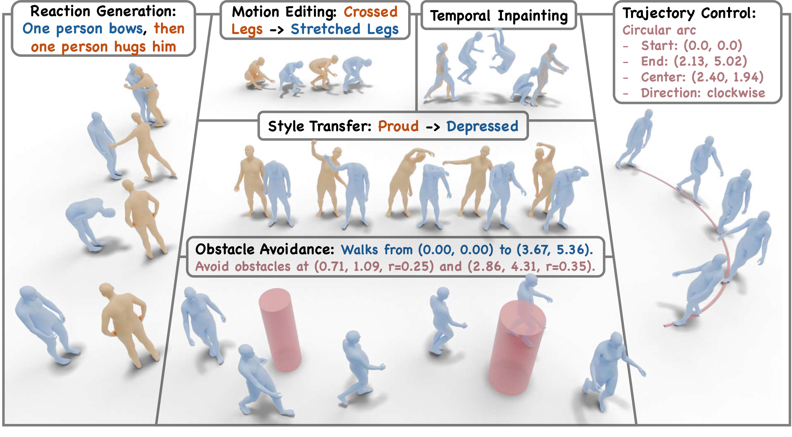

# UMO: Unified In-Context Learning Unlocks Motion Foundation Model Priors

[](https://oliver-cong02.github.io/UMO.github.io/) [](https://arxiv.org/pdf/2603.15975) [](https://arxiv.org/abs/2603.15975)

> **UMO: Unified In-Context Learning Unlocks Motion Foundation Model Priors** <br>

> [Xiaoyan Cong](https://oliver-cong02.github.io/)\*, [Zekun Li](https://kunkun0w0.github.io/)\*, [Zhiyang Dou](https://frank-zy-dou.github.io/), [Hongyu Li](https://lhy.xyz/), [Omid Taheri](https://otaheri.github.io/), [Chuan Guo](https://ericguo5513.github.io/), [Abhay Mittal](https://scholar.google.com/citations?hl=en&user=BwE_L4MAAAAJ&view_op=list_works&sortby=pubdate), [Sizhe An](https://sizhean.github.io/), [Taku Komura](https://i.cs.hku.hk/~taku/), [Wojciech Matusik](https://cdfg.mit.edu/wojciech), [Michael J. Black](https://is.mpg.de/ps/person/black), [Srinath Sridhar](https://srinathsridhar.com/) <br>

## Abstract



We introduce UMO, a unified motion foundation model that leverages in-context learning to handle diverse motion tasks within a single framework. UMO formulates motion generation, editing, and understanding as in-context learning problems, enabling the model to learn task-specific priors from demonstrations. Our approach defines three meta-operations — motion generation, motion inpainting, and motion editing — that can be composed to address a wide range of downstream tasks. Extensive experiments demonstrate that UMO achieves state-of-the-art performance across multiple motion benchmarks.

## TODO

- [x] Project page
- [x] arXiv paper
- [ ] Code release (coming soon)
- [ ] Model release (coming soon)

## Citation

Please cite our paper if you find this repository useful:

```bibtex
@misc{cong2026umounifiedincontextlearning,
      title={UMO: Unified In-Context Learning Unlocks Motion Foundation Model Priors},
      author={Xiaoyan Cong and Zekun Li and Zhiyang Dou and Hongyu Li and Omid Taheri and Chuan Guo and Abhay Mittal and Sizhe An and Taku Komura and Wojciech Matusik and Michael J. Black and Srinath Sridhar},
      year={2026},
      eprint={2603.15975},
      archivePrefix={arXiv},
      primaryClass={cs.CV},
      url={https://arxiv.org/abs/2603.15975},
}
```
